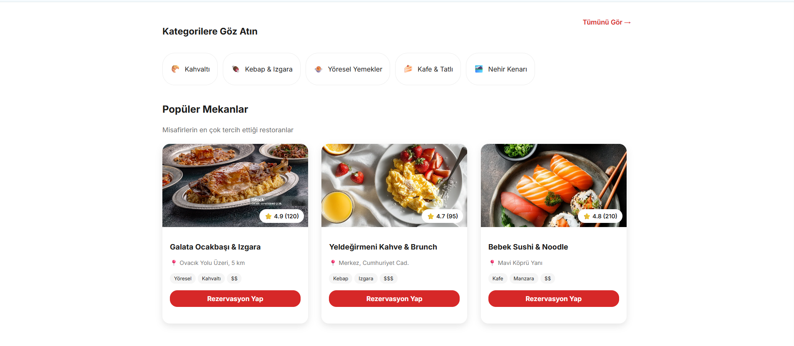
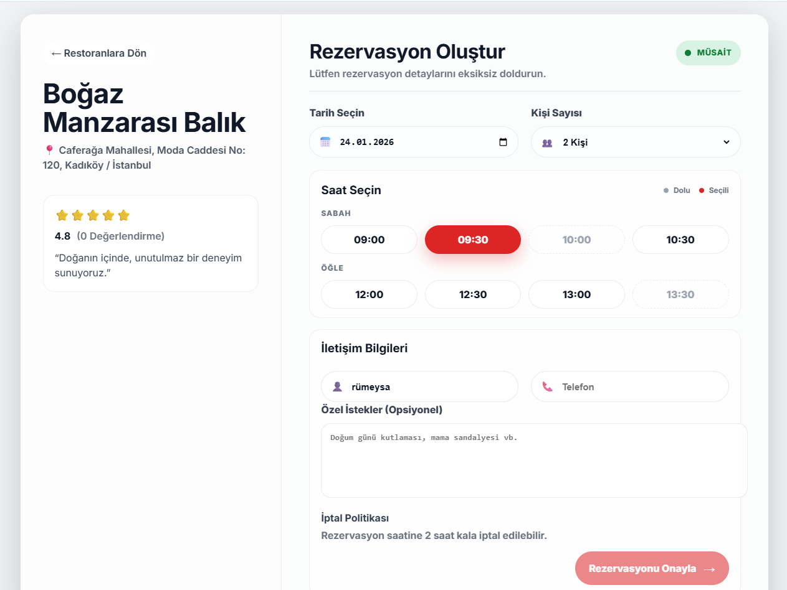
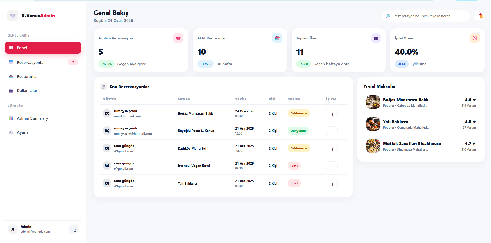
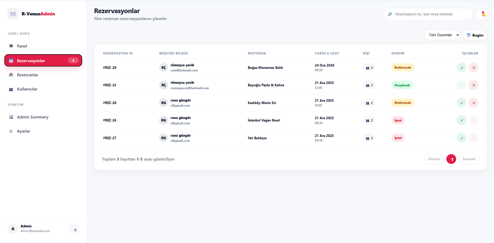
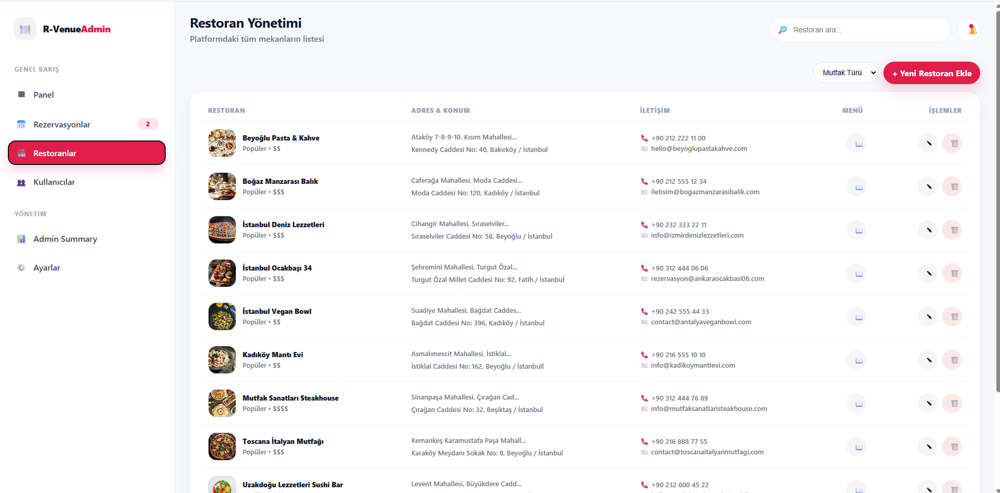
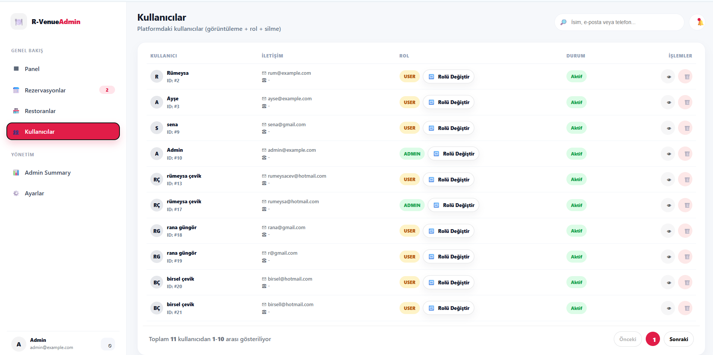
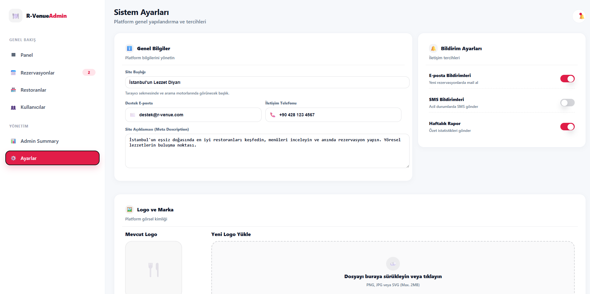

#  Restaurant Reservation System

This project is a **full-stack restaurant reservation system** developed as part of an academic project.
It allows customers to make reservations and enables administrators to manage restaurant tables and bookings efficiently.

---

##  Technologies Used

### Backend

* Java
* Spring Boot
* Maven
* MySQL

### Frontend

* React
* Vite
* JavaScript
* HTML5 & CSS3

---

##  Features

* User-friendly reservation interface
* Table and reservation management
* Backend RESTful APIs
* Database integration with MySQL
* Clean separation of frontend and backend

---

##  Project Structure

```
restaurant-reservation-system/
├── backend/
│   └── restaurantReservation/
│       ├── src/
│       └── pom.xml
├── frontend/
│   ├── src/
│   ├── public/
│   ├── package.json
│   └── vite.config.js
```

---

##  Setup & Run

### Backend

1. Open the backend project in NetBeans or IntelliJ
2. Configure MySQL connection
3. Run the Spring Boot application

### Frontend

```bash
npm install
npm run dev
```

---

##  Screenshots

Below are screenshots from different parts of the application:


---



---


---



---



---



---



---



---




---

##  License

This project is for educational purposes.
